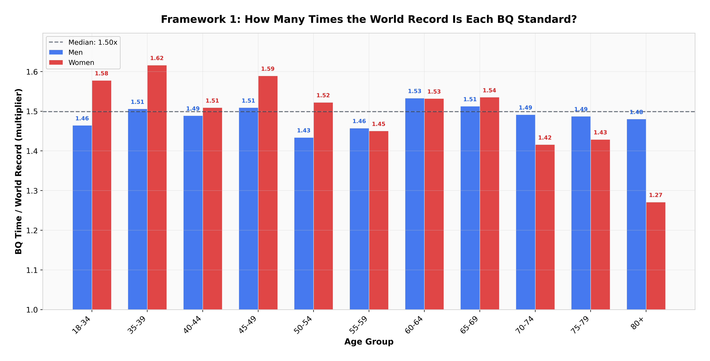
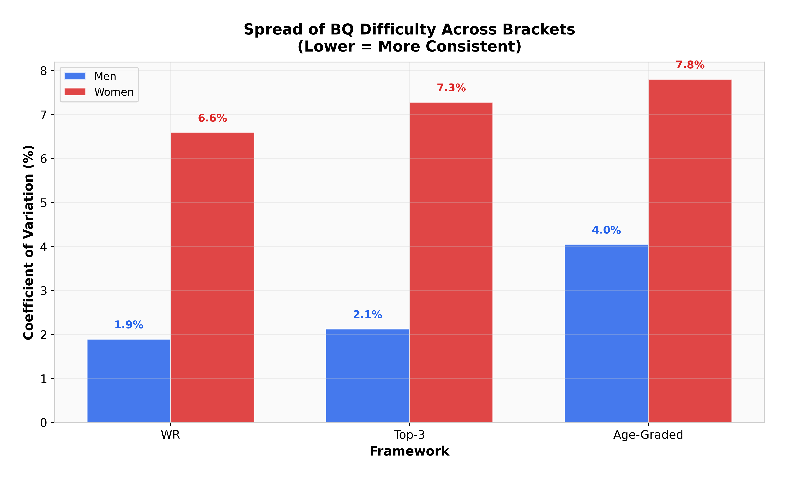
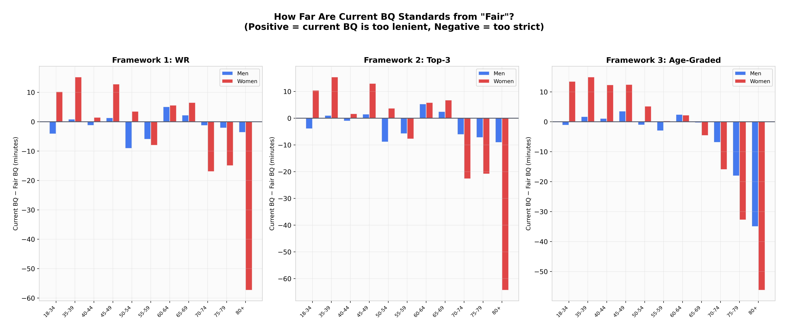
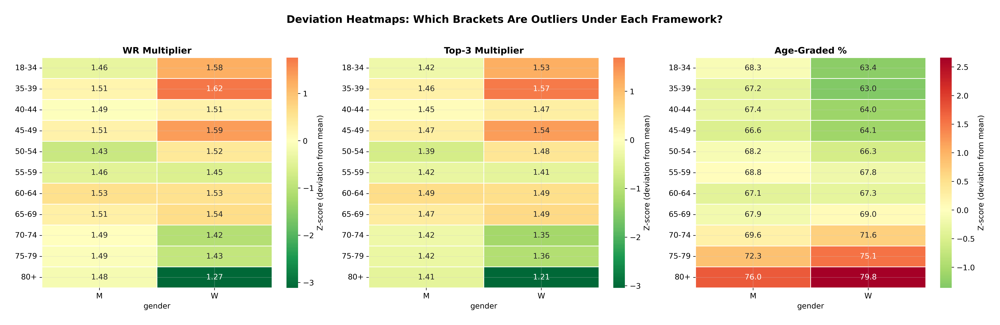
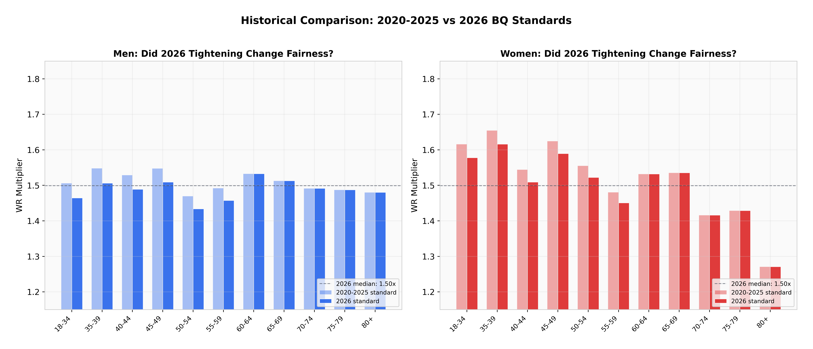
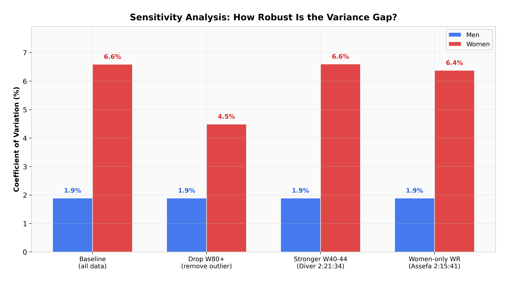

# Are Boston Marathon Qualifying Times Fair?

**A Three-Framework Comparative Analysis of BQ Standards Across Age and Gender**

*Jeremy Lee · May 2026 · [github.com/lyhjeremy/boston-marathon-qualifying-fairness](https://github.com/lyhjeremy/boston-marathon-qualifying-fairness)*

> 📄 This is the same content as the [PDF report](reports/Boston_BQ_Three_Frameworks_Report.pdf) and [Word doc](reports/Boston_BQ_Three_Frameworks_Report.docx), reformatted for easy reading directly on GitHub. For the interactive analysis, see the [Jupyter notebook](notebooks/boston_bq_fairness_analysis.ipynb).

---

## Abstract

The Boston Athletic Association sets qualifying times that vary by age and gender, but has never publicly disclosed the methodology behind these standards. This report examines whether current BQ times represent equal difficulty across all 22 age-gender brackets by applying three independent frameworks: (1) a world-record multiplier, (2) a top-three-records robustness check, and (3) WMA age-graded scoring. All three frameworks reveal the same structural pattern: men's brackets are remarkably consistent (CV 1.9–4.0%), while women's brackets show 3–4 times more variation (CV 6.6–7.8%), driven primarily by outlier reference records in younger and oldest brackets. A Welch t-test on gender means returns p = 0.81 under the WR framework, indicating no significant mean-level difference. The W80+ bracket stands out as the most miscalibrated under all frameworks. We present alternative BQ tables under each framework and discuss limitations.

---

## 1. Introduction

The Boston Marathon, first run in 1897, is the world's oldest annually contested marathon and one of only a handful of major marathons that requires a qualifying time for entry. The Boston Athletic Association (BAA) publishes qualifying standards across 11 age groups and two genders (plus a non-binary category adopted in recent years). For the 2026 race, the BAA tightened standards by five minutes for all athletes under 60, responding to record demand: 33,249 applications for roughly 24,000 qualifier spots.

Despite decades of adjustments, the BAA has never publicly explained the quantitative framework behind its qualifying times. Their rationale statements reference "careful analysis of results data" without specifying whether they optimize for equal difficulty, equal selectivity, field-size targets, or historical continuity. This creates a natural research question: are the qualifying times equitable across age and gender brackets?

We define "equitable" operationally as: every bracket requires the same proportional effort relative to a shared anchor. The choice of anchor is itself a fairness decision, which is why we apply three different anchors and compare what each reveals.

---

## 2. Data Sources

2026 BAA qualifying standards were sourced directly from baa.org. Open marathon world records (men: Sabastian Sawe, 1:59:30, London 2026; women mixed: Ruth Chepngetich, 2:09:56, Chicago 2024) were verified against World Athletics. Masters records (M35 through W80+) were compiled from the Wikipedia list of masters world records in road running, cross-referenced with WMA ratified records. WMA 2023 age-grading factors were sourced from the official Appendix B tables. Field-size data (24,362 accepted qualifiers, 4:34 cutoff) from BAA press releases.

**Scope:** 22 brackets (11 age groups × 2 genders). Non-binary athletes (110 accepted in 2026) are excluded because the BAA itself notes insufficient data to determine appropriate time standards for this category.

All four datasets live in [`data/`](data/) and are loaded by the notebook in [`notebooks/`](notebooks/).

---

## 3. Methodology

### 3.1 Framework 1: World Record Multiplier

For each bracket, we compute:

```
multiplier = BQ_time / world_record_time
```

If the BAA aimed for uniform difficulty under this framework, every bracket would have the same multiplier. Deviations indicate brackets where the standard is relatively easier or harder than average. For brackets below age 40, the open world record is used as the reference since no separate masters record exists. This is an acknowledged limitation: it makes the 35-39 bracket appear artificially easy.

### 3.2 Framework 2: Top-Three Records

Single world records are inherently outlier-sensitive. To test robustness, we replace the single WR with an estimated average of the top three known performances per bracket. For brackets with rich competition depth (35-69), we estimate the second- and third-best times at 3% and 6% slower than the WR, based on observed patterns from London 2026 masters results. For thin brackets (70+, 80+), we use 5% and 10% gaps. This is clearly an approximation; we flag it throughout.

### 3.3 Framework 3: WMA Age-Graded Scoring

World Masters Athletics publishes empirically derived age factors that represent the expected performance decline with age. We compute the age-adjusted standard for each bracket and ask: what fraction of their age-specific potential does each BQ standard demand? The formula:

```
age_graded_% = (open_WR / BQ_time) × (1 / WMA_factor) × 100
```

Unlike Frameworks 1 and 2, this approach accounts for the biological expectation at each age rather than anchoring to a single exceptional performance.

---

## 4. Results

### 4.1 Framework 1: World Record Multiplier

The median multiplier across all 22 brackets is **1.50×**, meaning the typical BQ standard is 50% slower than the world record for that bracket. Men's brackets cluster tightly (CV = 1.9%, range 1.43–1.53×), while women's brackets spread three times wider (CV = 6.6%, range 1.27–1.62×). A Welch t-test on gender means returns t = −0.25, p = 0.81, indicating no significant mean-level difference between genders. However, Levene's test for variance equality returns W = 5.04, p = 0.036, confirming the visual impression that women's brackets are significantly less consistent.



*Figure 1. BQ time as a multiple of world record, by age-gender bracket. Dashed line = median (1.50×). Women's bars show much wider spread.*

The most striking outlier is W80+ at 1.27×, meaning the BQ standard is only 27% slower than Yoko Nakano's extraordinary 4:11:45 world record. At the other extreme, W35-39 sits at 1.62×, making it the most lenient bracket relative to its reference. This 0.35× gap (from 1.27 to 1.62) represents the core inconsistency in women's standards.

### 4.2 Framework 2: Top-Three Records

Dampening single-record outliers by averaging the estimated top three performances per bracket shifts the median multiplier to 1.44× but does not substantially reduce women's CV (7.3% vs 6.6%). This tells us the inconsistency is not solely driven by individual outlier records; structural gaps in older women's brackets persist even with a more conservative reference.

### 4.3 Framework 3: Age-Graded Scoring

Under WMA age grading, the median age-graded percentage required to qualify for Boston is **67.9%**. Men's brackets average 68.3% (CV = 4.0%), women's 69.0% (CV = 7.8%). Welch t-test: t = 0.42, p = 0.68, again showing no significant mean-level gender difference. The age-graded framework reveals something the WR framework obscures: older brackets (75-79, 80+) are substantially harder than they appear, because the WMA factors expect steeper performance decline than the BQ standards allow for.



*Figure 2. Coefficient of variation across frameworks. Women's brackets are 3-4× more variable than men's under all three frameworks.*



*Figure 3. Difference between current BQ and "fair" BQ (in minutes). Positive = current BQ is lenient; negative = current BQ is strict.*

---

## 5. Cross-Framework Findings

Three findings are robust across all frameworks:

**Finding 1: No mean-level gender bias.** Under all frameworks, the average difficulty for men and women is statistically indistinguishable (p > 0.68). The BAA appears to have calibrated the average correctly across genders.

**Finding 2: Women's brackets are 3-4× more variable.** CV for men ranges 1.9-4.0% across frameworks; for women, 6.6-7.8%. This is driven by a combination of outlier reference records and the structural challenge of calibrating standards for brackets with thinner competition depth.

**Finding 3: W80+ is the most miscalibrated bracket.** Under the WR framework, the current BQ is **57 minutes too strict** relative to what a uniform multiplier would suggest. Under age-grading, it is **56 minutes too strict**. This is the single most defensible critique: regardless of which framework you prefer, the W80+ standard appears too hard.



*Figure 4. Deviation heatmaps. Red cells = bracket is harder than average; green = easier than average. W80+ is consistently red across all frameworks.*

---

## 6. Historical Comparison: Did 2026 Tightening Help Fairness?

The 2026 race introduced the largest single tightening of qualifying times since 1990: five minutes across the board for athletes under 60. While framed as a response to record demand, the change also raises the question of whether the tightening improved fairness across brackets or simply shifted everything uniformly.



*Figure 5. 2020-2025 standards (light bars) vs 2026 standards (dark bars), expressed as WR multipliers. The tightening was uniform within each gender, leaving the relative bracket structure unchanged.*

The tightening lowered every under-60 multiplier by roughly the same proportion, leaving the relative structure of the standards unchanged. The 60+ brackets were untouched. Women's CV in 2020-2025 (approximately 6.8%) and 2026 (6.6%) are essentially identical. The 2026 changes responded to demand, not to inter-bracket fairness.

An unintended consequence: by tightening only under-60 standards, the BAA implicitly steepened the gap between the 55-59 and 60-64 brackets. The men's gap grew from 15 to 20 minutes. This "birthday cliff" is now larger than it was previously.

---

## 7. Sensitivity Analysis

We stress-tested the main variance-gap finding against three alternative scenarios:

- **Scenario A:** Drop W80+ entirely (remove the largest outlier).
- **Scenario B:** Use Sinead Diver's W40 marathon (2:21:34) as the W40-44 reference.
- **Scenario C:** Use Tigst Assefa's women-only WR (2:15:41) for W18-34 instead of the mixed-race record.



*Figure 6. Sensitivity analysis. Men's CV stays at 1.9% across all scenarios; women's CV drops from 6.6% to 4.5% only when removing W80+, demonstrating that the variance gap is robust to alternative reference records.*

Results: men's CV stays at 1.9% across every scenario, confirming there is no comparable outlier in the men's data. Women's CV drops to 4.5% only when W80+ is removed entirely. Alternative record choices (Diver, Assefa) shift women's CV by less than 0.3 percentage points. **The variance gap is genuine and not an artifact of which records we anchor to.**

---

## 8. Complete Bracket-by-Bracket Table

All 22 brackets, with each framework's headline metric and the suggested fair BQ under Frameworks 1 and 3. Numbers below the median row in either framework indicate brackets whose current BQ is *stricter* than the fair value; numbers above indicate brackets whose current BQ is *more lenient*.

| Age Group | Sex | Current BQ | WR Mult | Top-3 Mult | AG % | Fair BQ (WR) | Fair BQ (AG) |
|:---------:|:---:|:----------:|:-------:|:----------:|:----:|:------------:|:------------:|
| 18-34 | **M** | 2:55:00 | 1.464 | 1.422 | 68.3 | 2:59:07 | 2:56:08 |
| 18-34 | **W** | 3:25:00 | 1.578 | 1.532 | 63.4 | 3:14:45 | 3:11:30 |
| 35-39 | **M** | 3:00:00 | 1.506 | 1.462 | 67.2 | 2:59:07 | 2:58:16 |
| 35-39 | **W** | 3:30:00 | 1.616 | 1.569 | 63.0 | 3:14:45 | 3:15:01 |
| 40-44 | **M** | 3:05:00 | 1.489 | 1.446 | 67.4 | 3:06:14 | 3:03:51 |
| 40-44 | **W** | 3:35:00 | 1.509 | 1.465 | 64.0 | 3:33:31 | 3:22:39 |
| 45-49 | **M** | 3:15:00 | 1.509 | 1.465 | 66.6 | 3:13:39 | 3:11:27 |
| 45-49 | **W** | 3:45:00 | 1.589 | 1.543 | 64.1 | 3:32:11 | 3:32:33 |
| 50-54 | **M** | 3:20:00 | 1.434 | 1.392 | 68.2 | 3:29:04 | 3:21:04 |
| 50-54 | **W** | 3:50:00 | 1.522 | 1.478 | 66.3 | 3:46:27 | 3:44:46 |
| 55-59 | **M** | 3:30:00 | 1.457 | 1.415 | 68.8 | 3:35:58 | 3:32:58 |
| 55-59 | **W** | 4:00:00 | 1.451 | 1.408 | 67.8 | 4:07:59 | 3:59:41 |
| 60-64 | **M** | 3:50:00 | 1.533 | 1.488 | 67.1 | 3:44:53 | 3:47:33 |
| 60-64 | **W** | 4:20:00 | 1.532 | 1.487 | 67.3 | 4:14:23 | 4:17:45 |
| 65-69 | **M** | 4:05:00 | 1.513 | 1.469 | 67.9 | 4:02:44 | 4:05:18 |
| 65-69 | **W** | 4:35:00 | 1.535 | 1.491 | 69.0 | 4:28:27 | 4:39:34 |
| 70-74 | **M** | 4:20:00 | 1.492 | 1.421 | 69.6 | 4:21:17 | 4:26:52 |
| 70-74 | **W** | 4:50:00 | 1.416 | 1.349 | 71.6 | 5:06:58 | 5:05:55 |
| 75-79 | **M** | 4:35:00 | 1.487 | 1.417 | 72.3 | 4:37:07 | 4:53:04 |
| 75-79 | **W** | 5:05:00 | 1.429 | 1.361 | 75.1 | 5:19:56 | 5:37:46 |
| 80+ | **M** | 4:50:00 | 1.480 | 1.410 | 76.0 | 4:53:38 | 5:24:58 |
| 80+ | **W** | 5:20:00 | 1.271 | 1.211 | 79.8 | 6:17:20 | 6:16:15 |

*Table 1. Current BQ is the official 2026 BAA standard. WR Mult and Top-3 Mult are dimensionless ratios (BQ time / reference time). AG % is the age-graded percentage. Fair BQ columns show what each framework would suggest if the median multiplier (1.50×) or median AG % (67.9%) were applied uniformly across all brackets. Notice the W80+ row: current BQ 5:20:00, fair BQ (WR) 6:17:20, a 57-minute gap.*

---

## 9. Limitations

**Single-record dependence.** Frameworks 1 and 2 anchor to individual performances. Thin brackets (especially older women's) are dominated by one extraordinary athlete. Framework 3 mitigates this by using population-level age factors, but those factors are themselves derived from historical data that may underrepresent certain demographics.

**Under-35 bracket ambiguity.** No separate masters records exist below age 35, so the 18-34 and 35-39 brackets use the open world record as reference. This artificially compresses the multiplier for 35-39, making it appear easier than it is.

**Top-3 estimation.** Framework 2 estimates second and third performances using fixed depth factors rather than verified data. This is transparent but approximate.

**Fairness is multi-dimensional.** These frameworks measure difficulty-parity only. The BAA may legitimately optimize for other objectives: field-size diversity, historical continuity, participation encouragement, or competitive depth. A standard that looks "unfair" under one lens may be optimal under another.

**Statistical power.** With n = 11 per gender, formal tests are underpowered. The Levene test at p = 0.036 crosses the 0.05 threshold but should be interpreted cautiously given the small sample.

---

## 10. Conclusion

The BAA's qualifying standards are, on average, well-calibrated across genders. The criticism that "Boston is unfair to women" does not survive statistical testing under any of the three frameworks examined here. What does emerge is a variance problem: women's brackets are significantly less consistent than men's, and the W80+ bracket is a genuine outlier regardless of framework.

The choice of fairness framework matters. World records are transparent but outlier-sensitive. Top-three averages are more robust but require estimation. Age-graded scoring is the most empirically grounded but hides its assumptions inside the WMA factor tables. No single framework is definitively correct. The value of this analysis lies in showing what each reveals and letting the reader judge which trade-offs matter most.

---

## Reproducibility

All code, data, and outputs are in this repository:

| Path | What it is |
|---|---|
| [`notebooks/boston_bq_fairness_analysis.ipynb`](notebooks/boston_bq_fairness_analysis.ipynb) | Interactive notebook reproducing every analysis and figure in this writeup |
| [`data/`](data/) | The four source CSVs (BQ standards, world records, WMA factors, field size) |
| [`outputs/figures/`](outputs/figures/) | All 8 figures at 400 DPI |
| [`outputs/analysis_results.csv`](outputs/analysis_results.csv) | Complete results table (22 brackets × 20 metrics) |
| [`reports/Boston_BQ_Three_Frameworks_Report.pdf`](reports/Boston_BQ_Three_Frameworks_Report.pdf) | Formatted PDF version |
| [`reports/Boston_BQ_Three_Frameworks_Report.docx`](reports/Boston_BQ_Three_Frameworks_Report.docx) | Formatted Word version |
| [`src/analysis.py`](src/analysis.py) | Standalone script that regenerates every figure and CSV |

To reproduce everything from scratch:

```bash
git clone https://github.com/lyhjeremy/boston-marathon-qualifying-fairness.git
cd boston-marathon-qualifying-fairness
pip install -r requirements.txt
python src/analysis.py
```

---

*© 2026 Jeremy Lee · MIT License · Data current as of May 2026*
